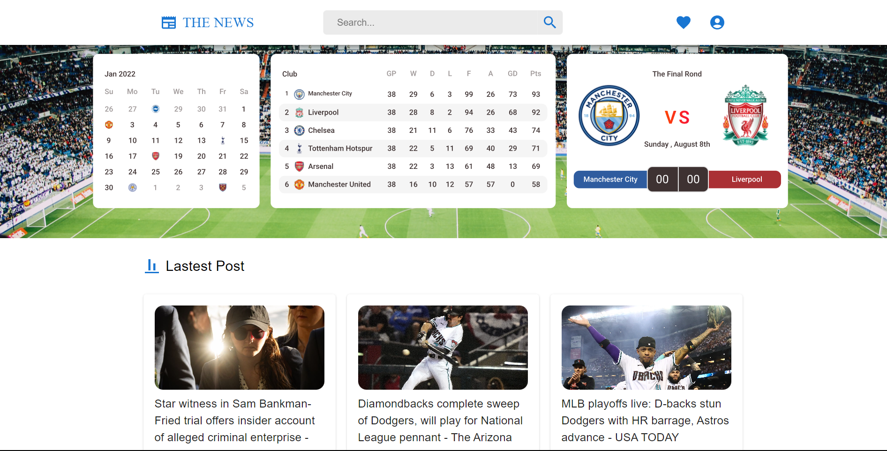

<h1 align="center">
  TheNews
</h1>
<div align="center">
  
</div>


## Description

TheNews is  your premier news destination, offers the freshest updates and insightful reports, keeping you informed and engaged

## Built With

- [React.js]
- [MaterialUI]
- [Axios]
- [NewsAPI]

## 🛠 Installation & Set Up

1. Clone the repo
   ```sh
   git clone https://github.com/rdhss/TheNews.git
   ```
1. change dir
   ```sh
   cd TheNews
   ```
2. Install NPM packages
   ```sh
   npm install
   ```
3. Start the Application
   ```sh
   npm start
   ```